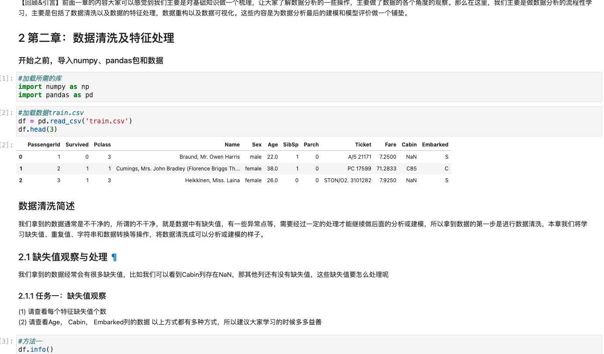

# Hands-on data analysis

# 动手学数据分析

## 项目初衷

动手学数据分析是Datawhale关于数据分析方向的开源项目，这个项目始于Datawhale以前的数据分析课程，那时我作为一名学员的以《python for data analysis》这本书为教材教材，通过刷这本教材的代码来学习数据分析，书里对于pandas和numpy操作讲的很细，但是对于数据分析的逻辑的内容，就少了很多。所以很多学习者和我学完之后发现，敲了一堆代码并不知道它们有什么用。“不知道怎么用”这个想法其实很好理解，在学完了比较理论的东西之后，在生活中实际运用方式和从理论中学到的会有不小的鸿沟。如何抹平这个鸿沟，可能就需要自己的尝试以及学习实战的资料。

所以有没有这样一门课，以项目为主线，将知识点孕育其中，通过边学，边做以及边被引导的方式来使学习效果达到更好，学完之后既能掌握pandas等的知识点又能掌握数据分析的大致思路和流程。通过调查发现，市面上关于**数据分析**的项目好像没有可以完全符合这样标准的（失望.jpg）。所以Datawhale的小伙伴一拍即合，一起来做一门这样的开源课程，完成上面所说的那些小目标，让所有使用了我们课程的小伙伴可以更好的开启他的数据分析之路。

现在这门课程已经更新到了1.3版本，我们改善了更好的学习流程，以及提供了更好的答案讲解。后期将会逐步推出配套的教材。我们还是希望从基础的数据分析操作和数据分析流程讲起，在每个模块都引入实战的例子。之后会不断加入新的内容（比如数据挖掘的算法之类的）。这是开源项目，我们会不断迭代，大家共同参与，一起努力。

关于我们项目的名字——动手学数据分析（Hands-on data analysis）。数据分析是一个要从一堆数字中看到真相的过程。学会操作数据只是数据分析的一半功力，剩下的另一半要用我们的大脑，多多思考，多多总结，更要多动手，实打实的的敲代码。所以也希望在学习这门课时，多去推理，多去问问为什么；多多练习，确保理论实践结合起来，在课程结束的时候一定会有大收获。

#### 搭配资料

既然这是一门诞生于Datawhale的课程，学习它的时候搭配datawhale所配备其他资源会更好。我们提供的代码是jupyter形式的，里面有你所要完成的任务，也有我们给你的提示和引导，所以这样的形式再结合Datawhale的[组队学习](https://github.com/datawhalechina/team-learning-data-mining)，可以和大家一起讨论，一起补充资料，那么学习效果一定会加倍。还有，Datawhale之前开源了一门pandas的教程—[Joyful-Pandas](https://github.com/datawhalechina/joyful-pandas)。里面梳理了Pandas的逻辑以及代码展示，所以在我们数据分析的课程中，关于Pandas的操作，你可以参考*Joyful-Pandas*，可以让你的数据分析学习事半功倍。

## 项目编排与服用方法

#### 编排

课程现分为三个单元，大致可以分为：数据基础操作，数据清洗与重构，建模和评估。

1. 第一部分：我们获得一个要分析的数据，我要学会如何加载数据，查看数据，然后学习Pandas的一些基础操作，最后开始尝试探索性的数据分析。
2. 第二部分：当我们可以比较熟练的操作数据并认识这个数据之后，我们需要开始数据清洗以及重构，将原始数据变为一个可用好用的数据，为之后放入模型做准备
3. 第三单元：我们根据任务需求不同，要考虑建立什么模型，我们使用流行的sklearn库，建立模型。对于一个模型的好坏，我们是需要评估的，之后我们会评估我们的模型，对模型做优化。

| 章节   |        小结        |
| :----- | :----------------: |
| 第一章 | 数据载入及初步观察 |
|        |     pandas基础     |
|        |   探索性数据分析   |
| 第二章 | 数据清洗及特征处理 |
|        |     数据重构1      |
|        |     数据重构2      |
|        |     数据可视化     |
| 第三章 |      数据建模      |
|        |      模型评估      |

#### 服用方法

我们的代码都是jupyter形式，每个部分的课程都分为**课程**和**答案**两个部分。学习期间，在课程代码中，完成所有的学习，自己查找资料，自己完成里面的代码操作，思考部分以及心得。之后可以和小伙伴讨论，分享资料和心得。关于答案部分，大家可以参考，但是由于数据分析本身是开放的，所以答案也是开放式的，更多希望大家可以有自己理解和答案。 如果需要参考，我们在**答案** 部分提供了我们写的答案，大家可以参考。

(课程部分-需要自己根据要求敲代码)

(参考答案部分-如果有问题可以参考我们提供的答案)

## 反馈

之前版本学习者反馈

> 作为一个没基础的小白学习者，这期动手学数据分析我学得很舒服，教程也比较简单和清楚，整体学下来感觉是很流畅的。每个task我都会把教程看两遍。第一遍只看教程，按着教程思路顺下来，看完以后再啃利用Python进行数据分析这本书，边看边做笔记（顺便把csdn写了）作业的拓展性这里必须给我加分，然后第二遍看教程就是完全不看答案把作业和思考做完。基本上学完还是很有成就感的，而且真的有学到很多东西。这个课程作为一个数据分析的入门课程，真的巨赞！
>
> --------华北电力大学，吴丹飞

> 首先这个学习文档做得很好，很有引导性，也是我看下来项目中比较好的一种学习方式——主动学习，不懂就搜索、问。
> 作为有Python数据分析基础的学员很有复习、提高、巩固的功能。项目相对来说没有那么的贴切生活.建模那一块我之前有接触过，但是我搞不懂就没什么可建议的了.
>
> -------- 李晴晴ß

>
>
>帮助还不小，因为后面做项目感觉还在不断用这些技巧，非常有用。我觉得可以加点数据分析的分析思路过程。
>
>--------V1.0 版组队学习参与者

**优秀学员刘楚楚优秀作业**：https://space.bilibili.com/621981283/channel/detail?cid=191222

（欢迎大家观看这个视频讲解的优秀作业）

## 改进方式

若动手学数据分析里没有你想要的内容，或者你发现项目中哪里有错误，请毫不犹豫地去我们GitHub的Issues进行反馈，说明提问内容属于哪一个部分，然后提交你希望补充内容或者勘误信息，我们通常会在24小时以内给您回复，超过24小时未回复的话可以邮件联系我（chenands@qq.com）；

## 贡献者

**项目负责人**

陈安东：Datawhale成员，哈尔滨工业大学|Queen Marry University of London(项目负责人)

**核心贡献者**

金娟娟：Datawhale成员，浙江大学硕士

杨佳达：Datawhale成员，数据挖掘工程师

老表：Datawhale成员，公众号简说Python作者

**贡献者**

红星：Datawhale成员，数据分析师

李玲：Datawhale成员，算法工程师

高立业：Datawhale成员，太原理工大学研究生

张文涛：Datawhale成员，中山大学博士研究生

## 关注我们

扫描下方二维码，然后回复关键词“动手学数据分析”，即可加入“项目交流群”

## LICENSE

本作品采用<a rel="license" href="http://creativecommons.org/licenses/by-nc-sa/4.0/">知识共享署名-非商业性使用-相同方式共享 4.0 国际许可协议</a>进行许可。

